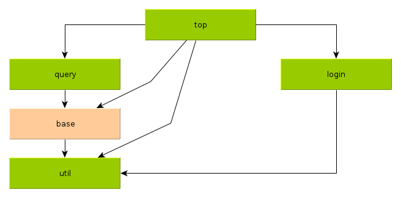

ULI-GRADLE
==========

This git repo contains my gradle tutorials and some sample projects.

Overview
--------

* [Gradle Coldstart](#gradle-coldstart)
* [Java Quickstart](#java-quickstart)
* [Java Quickstart with Gradle Wrapper](#java-quickstart-with-gradle-wrapper)
* [Avoiding Downloads With Gradle Wrapper](#avoiding-downloads-with-gradle-wrapper) (optional)
* [Gradle Wrapper](#gradle-wrapper) (optional)
* [Multi Project Build](#multi-project-build)
* [Flat Multi Project Build](#flat-multi-project-build) (optional)
* [External Dependencies](#external-dependencies)
* [External Dependencies via Proxy Server](#external-dependencies-via-proxy-server)
* [Forcing A Resolution](#forcing-a-resolution)
* [Bundle An Application](#bundle-an-application)
* [Adding JUnit Tests](#adding-junit-tests)
* [Adding Findbugs](#adding-findbugs)
* [Creating Eclipse Projects](#creating-eclipse-projects)
* [Logging Based On SLF4J/LOG4J](#logging-based-on-slf4j-log4j)
* [Logging Based On SLF4J/LOGBACK](#logging-based-on-slf4j-logback)
* [Logging Based On SLF4J/LOG4J-2.0](#logging-based-on-slf4j-log4j-2.0)
* [Developing a Web Application](#developing-a-web-application)
* [Developing a JSF Web Application](#developing-a-jsf-web-application)
* [Debugging a JSF Web Application](#debugging-a-jsf-web-application)
* [A JSF Web Application With JavaMelody Monitoring](#web-application-monitoring-with-javamelody)
* [JPA Based On Hibernate](#jpa-based-on-hibernate)
* [JPA Based On EclipseLink](#jpa-based-on-eclipselink)
* [Springboot](#springboot)
* [Markdown](#markdown)
* [Groovy Quickstart](#groovy-quickstart)

Gradle Coldstart
----------------

* Download the [gradle.zip](http://downloads.gradle.org/distributions/gradle-2.2.1-all.zip)

* Unzip it to a folder of your choice, for example $HOME/opt/gradle-2.2.1

* Add $HOME/opt/gradle-2.2.1/bin to the PATH environment variable

* Execute `gradle -v` and expect an output like this

  ```
  ------------------------------------------------------------
  Gradle 2.2.1
  ------------------------------------------------------------
  
  Build time:   2014-11-24 09:45:35 UTC
  Build number: none
  Revision:     6fcb59c06f43a4e6b1bcb401f7686a8601a1fb4a
  
  Groovy:       2.3.6
  Ant:          Apache Ant(TM) version 1.9.3 compiled on December 23 2013
  JVM:          1.7.0_71 (Oracle Corporation 24.71-b01)
  OS:           Linux 3.18.4-031804-lowlatency amd64
  ```

Java Quickstart
---------------

Example: See [010-java-quickstart](010-java-quickstart). Note: You have
to install gradle first! See "Gradle Coldstart" for details!

* Create a java source file within src/main/java, for example
  src/main/java/org/uli/httpcat/HttpCat.java

* Create a gradle build file named build.gradle

  ```
  apply plugin: "java"
  ```

* Compile the java source file and create a jar file

  ```
  $ gradle jar
  :compileJava
  :processResources UP-TO-DATE
  :classes
  :jar
  
  BUILD SUCCESSFUL
  
  Total time: 2.917 secs
  ```

Java Quickstart With Gradle Wrapper
-----------------------------------

Example: See [020-java-quickstart-gradlew](020-java-quickstart-gradlew).
Note: You don't have to install gradle first!

* Assume you have a project with
    * a script named gradlew
    * a batch file named gradlew.bat
    * a folder named gradle

* Typically, there will be a build file named "build.gradle"

* Compile the java source file and create a jar file

  ```
  $ ./gradlew jar
  Downloading http://services.gradle.org/distributions/gradle-2.2.1-bin.zip
  ................................................
  .....................................................
  Unzipping .../wrapper/dists/gradle-2.2.1-bin/64p.../gradle-1.12-bin.zip to .../wrapper/dists/gradle-1.12-bin/64p...
  Set executable permissions for: .../wrapper/dists/gradle-2.2.1-bin/64p.../gradle-1.12/bin/gradle
  :compileJava
  :processResources UP-TO-DATE
  :classes
  :jar
  
  BUILD SUCCESSFUL
  
  Total time: 2.917 secs
  ```

Avoiding Downloads With Gradle Wrapper
--------------------------------------

Example: See [020-java-quickstart-gradlew](020-java-quickstart-gradlew)
(same as before).

* If you use multiple PCs for development,
  gradle will be downloaded before starting the first build

  ```
  otherpc$ ./gradlew jar
  Downloading http://services.gradle.org/distributions/gradle-2.2.1-bin.zip
  ................................................^C
  otherpc$
  ```

* You can avoid this by copying the folder "$HOME/.gradle"

  ```
  thispc$ rsync -ruv "$HOME/.gradle" uli@otherpc:
  ```

  Note: Replace "otherpc" by the name of the other pc and "uli" by
  your username on the other pc!

* Now the build runs fine without a download

  ```
  otherpc$ ./gradlew jar
  :compileJava
  :processResources UP-TO-DATE
  :classes
  :jar
  
  BUILD SUCCESSFUL
  
  Total time: 2.933 secs
  ```

Gradle Wrapper
--------------

Example: See [030-gradle-wrapper](030-gradle-wrapper)
Within this chapter, we describe how to bootstrap the gradle wrapper.

* Starting point: The java quickstart project

* Add the Wrapper task to the gradle build file 

  ```
  apply plugin: "java"

  task wrapper(type: Wrapper) {
    gradleVersion = '2.2.1'
  }
  ```

* Execute the wrapper task

  ```
  $ gradle wrapper
  :wrapper

  BUILD SUCCESSFUL

  Total time: 3.62 secs
  ```

* Add the generated files to your version control system (subversion, git)

  ```
  $ git add -v gradle*
  add '02-gradle-wrapper/gradle/wrapper/gradle-wrapper.jar'
  add '02-gradle-wrapper/gradle/wrapper/gradle-wrapper.properties'
  add '02-gradle-wrapper/gradlew'
  add '02-gradle-wrapper/gradlew.bat'
  ```

* Run the build using gradle wrapper

  ```
  $ ./gradlew jar
  Downloading http://services.gradle.org/distributions/gradle-2.2.1-bin.zip
  ................................................
  .....................................................
  Unzipping .../.gradle/wrapper/dists/gradle-2.2.1-bin/.../gradle-1.12-bin.zip to .../.gradle/wrapper/dists/gradle-1.12-bin/...
  Set executable permissions for: .../.gradle/wrapper/dists/gradle-2.2.1-bin/.../gradle-1.12/bin/gradle
  :compileJava
  :processResources UP-TO-DATE
  :classes
  :jar
  
  BUILD SUCCESSFUL
  
  Total time: 5 mins 19.649 secs
  ```

Multi Project Build
-------------------

Example: See [040-multi-project](040-multi-project).

* Starting point: You have multiple separate projects

    * 010-java-quickstart

    * 020-java-quickstart-gradlew

    * 030-gradle-wrapper

* Create a new project: 041-multi-project

* Within the new project: Create the file settings.gradle

  ```
  include '..:010-java-quickstart',
          '..:020-java-quickstart-gradlew',
          '..:030-gradle-wrapper'
  ```

  Note: Don't use '../010-java-quickstart' or similar!

* Now execute the multi build

  ```
  $ gradle jar
  :..:010-java-quickstart:compileJava
  :..:010-java-quickstart:processResources UP-TO-DATE
  :..:010-java-quickstart:classes
  :..:010-java-quickstart:jar
  :..:020-java-quickstart-gradlew:compileJava
  :..:020-java-quickstart-gradlew:processResources UP-TO-DATE
  :..:020-java-quickstart-gradlew:classes
  :..:020-java-quickstart-gradlew:jar
  :..:030-gradle-wrapper:compileJava
  :..:030-gradle-wrapper:processResources UP-TO-DATE
  :..:030-gradle-wrapper:classes
  :..:030-gradle-wrapper:jar
  
  BUILD SUCCESSFUL
  
  Total time: 3.841 secs
  ```

Flat Multi Project Build
------------------------

Example: See [043-flat-multi-project](043-flat-multi-project).

* Starting point: You have multiple separate projects

    * [util](043-flat-multi-project/util)

    * [base](043-flat-multi-project/base)

    * [query](043-flat-multi-project/query)

    * [login](043-flat-multi-project/login)

    * [top](043-flat-multi-project/top)

* All these project do live within separate folders

* There are these dependencies between them:

    * [util](043-flat-multi-project/util): Depends on nothing

    * [base](043-flat-multi-project/base): Depends on util

    * [query](043-flat-multi-project/query): Depends on base

    * [login](043-flat-multi-project/login): Depends on util

    * [top](043-flat-multi-project/top): Depends on all other projects

  

* Start with the most basic project having no dependencies to other projects: [util](043-flat-multi-project/util):

    * Create [build.gradle](043-flat-multi-project/util/build.gradle)

    * Do a test build: `gradle check` - expect "BUILD SUCCESSFUL"

* Do the next level projects now: [base](043-flat-multi-project/base) and [login](043-flat-multi-project/login):

    * Create build.gradle files - [base/build.gradle](043-flat-multi-project/base/build.gradle),  [login/build.gradle](043-flat-multi-project/login/build.gradle)

    * Create settings.gradle files - [base/settings.gradle](043-flat-multi-project/base/settings.gradle),  [login/settings.gradle](043-flat-multi-project/login/settings.gradle)

    * Do a test builds for these projects: `gradle check` - expect "BUILD SUCCESSFUL"

* Do the [query](043-flat-multi-project/base) project now: 

    * Create [build.gradle](043-flat-multi-project/query/build.gradle)

    * Create [settings.gradle](043-flat-multi-project/query/settings.gradle). Please note: You have to include "base" and "util", although "util" is a transitiv dependency of "base"!

    * Do a test build: `gradle check` - expect "BUILD SUCCESSFUL"

* Do the [top](043-flat-multi-project/top) project now: 

    * Create [build.gradle](043-flat-multi-project/top/build.gradle)

    * Create [settings.gradle](043-flat-multi-project/top/settings.gradle). Include all the other projects here

    * Do a test build: `gradle check` - expect "BUILD SUCCESSFUL"

External Dependencies
---------------------

Example: See [050-external-dependencies](050-external-dependencies).

* Starting point: A simple project based on gradle wrapper, for example
  [020-java-quickstart-gradlew](020-java-quickstart-gradlew).

* Try a build: `./gradlew check` -> "BUILD SUCCESSFUL"

* Add a java source file using an external dependency like this:
  [HtmlUnescape.java](050-external-dependencies/src/main/java/org/uli/htmlunescape/HtmlUnescape.java).

* Try a build: `./gradlew check` -> "BUILD FAILED"

* Determine artifactId, groupId, and version of the external dependency. In
  our case, this can be found on the [overview page](http://commons.apache.org/proper/commons-lang/index.html) of Apache Commons Lang.

    * artifactId: commons-lang3
    * groupId: org.apache.commons
    * version: 3.1

* Add the dependency to [build.gradle](050-external-dependencies/build.gradle)

  ```
  ...
  dependencies {
    compile group: 'org.apache.commons', name: 'commons-lang3', version: '3.1'
  }

  repositories {
    mavenCentral()
  }
  ```

* Try another build: `./gradlew check` -> "BUILD SUCCESSFUL"

External Dependencies via Proxy Server
--------------------------------------

Example: See [051-proxy](051-proxy).

* Starting point: A simple project having external dependencies, for example
  [050-external-dependencies](050-external-dependencies) and an environment
  where a proxy server is required for accessing "the web"

* Try a build: `./gradlew check` -> "BUILD FAILED"

* Create a file named "gradle.properties" and specify your proxy settings

  ```
  systemProp.http.proxyHost=10.2.100.1
  systemProp.http.proxyPort=8080
  systemProp.http.proxyUser=username
  systemProp.http.proxyPassword=password
  systemProp.http.nonProxyHosts=*.nonproxyrepos.com|localhost
  ```

* Try another build: `./gradlew check` -> "BUILD SUCCESSFUL"

Forcing A Resolution
--------------------

Example: See [0512-force-resolution](0512-force-resolution)

* Starting point: A project having external dependencies, for example
  [072-slf4j-logback](072-slf4j-logback)

* Examine the project dependencies by looking at the output of
  `gradle dependencies`: Expect to see all dependencies to SLF4J
  to be resolved to SLF4J-1.7.5

* Add these lines to the file "build.gradle"

  ```
  configurations.all {
    resolutionStrategy {
      force 'org.slf4j:slf4j-api:1.7.2'
    }
  }
  ```

* Examine the project dependencies by looking at the output of
  `gradle dependencies`: Expect to see all dependencies to SLF4J
  to be resolved to SLF4J-1.7.2

Bundle An Application
---------------------

Example: See [052-application-bundling](052-application-bundling).


You'd like to build an application consisting of

* your java classes

* the external dependencies

* a start script

There is a gradle plugin which helps you doing this.

* Starting point: A project with external dependencies, for example
  a copy of [050-external-dependencies](050-external-dependencies).

* Modify the file [build.gradle](052-application-bundling/build.gradle): Add
  the application plugin and define the main class.

* Create a file [settings.gradle](052-application-bundling/settings.gradle):
  Define the project name.

* Run the build: `./gradlew installApp`

* Run the application:
  `./build/install/html-unescape/bin/html-unescape -f data/test-data.txt -t data/test-data.out`

* Delete the generated file (after looking at it):
  `rm -f data/test-data.out`

Copy Dependencies Into A Local Ivy Repository
---------------------------------------------

Example: See [053-local-repository(053-local-repository).


You'd like to have a local ivy repository containing all your
dependencies. This enables you to build the project without
any connection to the internet.

There is a gradle plugin which helps you doing this.

* Starting point: A project with external dependencies, for example
  a copy of [110-springboot](110-springboot).

* Modify the file [build.gradle](053-local-repository): Add
  the ivypot plugin and the task syncRemoteRepositories

* Run the build: `./gradlew syncRemoteRepositories`
  (ths typically takes a lot of time)

* Commit the ivy repo:
    * `git add syncRepo`
    * `git commit ...`

* Delete the generated file (after looking at it):
  `rm -f data/test-data.out`

Adding JUnit Tests
------------------

Example: See [055-junit](055-junit).

* Start with a Java project, for example [052-application-bundling](052-application-bundling)

* Add a JUnit test class: [HtmlUnescape3Test.java](055-junit/src/test/java/org/uli/htmlunescape/HtmlUnescape3Test.java). Be sure the class is located within src/test/java instead of src/main/java.

* Modify [build.gradle](055-junit/build.gradle):

    * Add a dependency to "junit"

* Execute the junit tests: `./gradlew check`

* View the test report in your browser: `firefox build/reports/tests/index.html`

Adding FindBugs
---------------

Example: See [057-findbugs](057-findbugs).

* Start with a Java project, for example [055-junit](055-junit)

* Modify [build.gradle](057-findbugs/build.gradle):

    * Add findbugs plugin

    * Enable html reports

    * Disable xml reports

* Execute the findbugs checks: `./gradlew check`

* View the test report in your browser: `firefox build/reports/findbugs/main.html`

* Fix findbugs issues

Creating Eclipse Projects
-------------------------

Example: See [060-creating-eclipse-projects](060-creating-eclipse-projects).

* Start with a copy of a gradle project, for example create a copy
  of [050-external-dependencies](050-external-dependencies).

* Modify the file [build.gradle](060-creating-eclipse-projects/build.gradle):
  Add the eclipse plugin.

  ```
  ...
  apply plugin: 'eclipse'
  ...
  ```

* Execute `./gradlew eclipse`

* Now you can import the project into eclipse

    * File - Import

    * General - Existing Projects into Workspace - Next

    * Select root directory: .../060-creating-eclipse-projects

    * Finish

Note: The eclipse project files to contain absolut paths to your working
environment, so you will probably never store them in a version control
system.

Logging Based On SLF4J/LOG4J
----------------------------

Example: See [070-slf4j-log4j](070-slf4j-log4j)

* Start with an ordinary gradle project

    * build.gradle ... a build script for a java project

    * src/main/java ... java sources

    * src/test/java ... junit tests

* Add dependency to SLF4J and LOG4J to the build script

* Add loggers to your source code

* Do a build and execute junit tests: `gradle check`

* Examine the test report: There are warnings related to log4j configuration

     * `firefox build/reports/tests/index.html`

     * Classes

     * org.uli.logging.EchoServerTest

     * Standard error

  shows this:

  ```
  log4j:WARN No appenders could be found for logger (org.uli.logging.EchoServer).
  log4j:WARN Please initialize the log4j system properly.
  log4j:WARN See http://logging.apache.org/log4j/1.2/faq.html#noconfig for more info.
  ```

* Create a log4j config file for test: src/test/resources/log4j.xml

* Do a build and execute junit tests again: `gradle check`

* Verify: No more warnings within test reports, a log file has been created!

* Note: Running the application produces a similar warning as before. This can be fixed by creating a log4j config file for production: src/main/resources/log4j.xml

Logging Based On SLF4J/LOGBACK
------------------------------

Example: See [072-slf4j-logback](072-slf4j-logback)

This is pretty similar to "Logging Based On SLF4J/LOG4J"!

* Start with an ordinary gradle project

    * build.gradle ... a build script for a java project

    * src/main/java ... java sources

    * src/test/java ... junit tests

* Add dependency to SLF4J and LOGBACK to the build script

* Add loggers to your source code

* Add logback configuration files for tests and production

    * src/main/resources/logback.xml

    * src/test/resources/logback-test.xml

* Do a build and execute junit tests: `gradle check`

Logging Based On SLF4J/LOG4J-2.0
--------------------------------

Example: See [074-slf4j-log4-2.0j](074-slf4j-log4j-2.0)

* Start with an ordinary gradle project

    * build.gradle ... a build script for a java project

    * src/main/java ... java sources

    * src/test/java ... junit tests

* Add dependency to SLF4J and LOG4J-2.0 to the build script

* Add loggers to your source code

* Do a build and execute junit tests: `gradle check`

* Create a log4j config file for test: src/test/resources/log4j2-test.xml

* Do a build and execute junit tests again: `gradle check`

* Verify: No more warnings within test reports, a log file has been created!

* Note: For running the application instead of the junit tests, create
  a log4j2 config file for production: src/main/resources/log4j2.xml

Developing a Web Application
----------------------------

Example: See [085-webapp](085-webapp).

* Copy some files from another project

    * `cd 085-webapp`
    * `cp ../020-java-quickstart-gradlew/gradle* .`

* Create the file [build.gradle](085-webapp/build.gradle)

  ```
  apply plugin: "java"
  apply plugin: "war"
  ```

* Create the webapp folder: `mkdir -p src/main/webapp/WEB-INF`

* Create a welcome file [src/main/webapp/index.html](085-webapp/src/main/webapp/index.html)

* Create the file [src/main/webapp/WEB-INF/web.xml](085-webapp/src/main/webapp/WEB-INF/web.xml)

* Generate the war file: `./gradlew assemble`

* Deploy the war file into Tomcat7: 
  `cp build/libs/085-webapp.war /opt/apache-tomcat-7.0.40/webapps`

  Note: This assumes that your Tomcat7 installation resides in
  /opt/apache-tomcat-7.0.40.

* Start Tomcat7:
  `/opt/apache-tomcat-7.0.40/bin/startup.sh`

* Navigate your browser to [http://localhost:8080/085-webapp/](http://localhost:8080/085-webapp/)

  Note: This assumes that your Tomcat7 listens to port 8080, which is the
  default setting.

Developing a JSF Web Application
--------------------------------

Example: See [090-jsf-webapp](090-jsf-webapp).

* Start with an ordinary web application project

    * `cp -a 085-webapp 090-jsf-webapp`

* Extend the file [build.gradle](090-jsf-webapp/build.gradle)

  ```
  apply plugin: "java"
  apply plugin: "war"

  dependencies {
    compile group: 'org.glassfish', name: 'javax.faces', version: '2.2.+'
  }

  repositories {
    mavenCentral()
  }
  ```

* Implement your jsf application. For my example, these are the required
  files:

    * src/main/java/org/uli/HelloBean.java
    * src/main/webapp/WEB-INF/web.xml
    * src/main/webapp/hello.xhtml
    * src/main/webapp/welcome.xhtml

  Note: These files have been derived from mkyong jsf tutorials!

* Generate the war file: `./gradlew assemble`

* Deploy the war file into Tomcat7: 
  `cp build/libs/090-jsf-webapp.war /opt/apache-tomcat-7.0.40/webapps`

  Note: This assumes that your Tomcat7 installation resides in
  /opt/apache-tomcat-7.0.40.

* Start Tomcat7:
  `/opt/apache-tomcat-7.0.40/bin/startup.sh`

* Navigate your browser to [http://localhost:8080/090-jsf-webapp/](http://localhost:8080/090-jsf-webapp/)

  Note: This assumes that your Tomcat7 listens to port 8080, which is the
  default setting.

The JSF application works OK in Tomcat7. There are issues when using Jetty.
Adding the jetty plugin and running the application by `./gradlew jettyRun` doesn't work.

Debugging a JSF Web Application
--------------------------------

In this chapter, we debug a jsf application within eclipse.
We use a tomcat server which is embedded into eclipse for this.

Example: See [091-debug-jsf](091-debug-jsf).

* Start with an ordinary jsf web application project

    * `cp -a 090-jsf-webapp 091-debug-jsf`

* Extend the file [build.gradle](091-debug-jsf/build.gradle)

  ```
  apply plugin: "java"
  apply plugin: "war"
  apply plugin: "eclipse-wtp"

  dependencies {
    compile group: 'org.glassfish', name: 'javax.faces', version: '2.2.+'
  }

  repositories {
    mavenCentral()
  }
  ```

* Create the eclipse project

    * `gradlew eclipse`

* Start eclipse and import the project

* Within eclipse, create a new server

    * File - New - Other
    * Server - Server - Next
    * Apache - Tomcat v7.0 Server - Next
    * Tomcat installation directors: /opt/apache-tomcat-7.0.50 - Next
    * Add resource "091-debug-jsf" - Finish

* Within eclipse, debug the project

    * Run - Debug As - Debug on server

The embedded tomcat will be started and the embedded browser shows up opening
http://localhost:8080/091-debug-jsf/. Within the debug perspective, you'll
be able to define breakpoints etc.

Debugging a JSF Web Application Using An External Tomcat
--------------------------------------------------------

In this chapter, we debug a jsf application within eclipse.
We use a separate tomcat instance for this, so no need to define a
tomcat server within eclipse and no need to configure deployment descriptors.

Example: See [091-debug-jsf-3](091-debug-jsf-3).

* Start with an ordinary jsf web application project

    * `cp -a 090-jsf-webapp 091-debug-jsf-3`

* Extend the file [build.gradle](091-debug-jsf-3/build.gradle)

  ```
  apply plugin: "java"
  apply plugin: "war"
  apply plugin: "eclipse-wtp"

  dependencies {
    compile group: 'org.glassfish', name: 'javax.faces', version: '2.2.+'
  }

  repositories {
    mavenCentral()
  }
  ```

* Create the war file

    * `gradlew war`

* Install tomcat on your machine, for example within the folder
  /opt/apache-tomcat-7.0.50

* Create scripts to start and stop tomcat

    * [start-tomcat.sh](091-debug-jsf-3/scripts/start-tomcat.sh) (for Linux)
    * [stop-tomcat.sh](091-debug-jsf-3/scripts/stop-tomcat.sh) (for Linux)
    * [start-tomcat.bat](091-debug-jsf-3/scripts/start-tomcat.bat) (for Windows)
    * [stop-tomcat.bat](091-debug-jsf-3/scripts/stop-tomcat.bat) (for Windows)

* Start tomcat

    * `./scripts/start-tomcat.sh /opt/apache-tomcat-7.0.50`

* Deploy the war file

    * `cp build/libs/*.war catalina_base/webapps/.`

* Start eclipse and import the project

* Configure eclipse for remote debugging

    * Run - Debug Configurations...
    * Type: Remote Java Application
    * New
    * Debug

* Open the class "HelloBean"

* Open the perspective "Debug"

Within the debug perspective, you'll
be able to define breakpoints etc.

Web Application Monitoring With JavaMelody
------------------------------------------

Example: See [092-javamelody](092-javamelody).

* Start with an ordinary web application project

    * `cp -a 090-jsf-webapp 092-javamelody`

* Extend the file [build.gradle](092-javamelody/build.gradle) - add jrobin and javamelody

        apply plugin: "java"
        apply plugin: "war"
        
        dependencies {
            compile group: 'org.glassfish', name: 'javax.faces', version: '2.2.+' // 2.2.6
            runtime 'net.bull.javamelody:javamelody-core:1.50.0'
            runtime 'org.jrobin:jrobin:1.5.9'
            runtime 'org.slf4j:slf4j-api:1.7.7'
        }
        
        repositories {
            mavenCentral()
        }

* Extend the web.xml (src/main/webapp/WEB-INF/web.xml):

        <filter>
                <filter-name>monitoring</filter-name>
                <filter-class>net.bull.javamelody.MonitoringFilter</filter-class>
        </filter>
        <filter-mapping>
                <filter-name>monitoring</filter-name>
                <url-pattern>/*</url-pattern>
        </filter-mapping>
        <listener>
                <listener-class>net.bull.javamelody.SessionListener</listener-class>
        </listener>

* Generate the war file: `./gradlew assemble`

* Deploy the war file into Tomcat7: 
  `cp build/libs/092-javamelody.war /opt/apache-tomcat-7.0.54/webapps`

  Note: This assumes that your Tomcat7 installation resides in
  /opt/apache-tomcat-7.0.54.

* Start Tomcat7:
  `/opt/apache-tomcat-7.0.54/bin/startup.sh`

* Navigate your browser to [http://localhost:8080/092-javamelody/](http://localhost:8080/092-javamelody/)

  Note: This assumes that your Tomcat7 listens to port 8080, which is the
  default setting.

  The JSF application works OK in Tomcat7. There are issues when using Jetty.
  Adding the jetty plugin and running the application by `./gradlew jettyRun` doesn't work.

* Navigate your browser to [http://localhost:8080/092-javamelody/monitoring](http://localhost:8080/092-javamelody/monitoring)

  Note: This assumes that your Tomcat7 listens to port 8080, which is the
  default setting.

JPA Based On Hibernate
----------------------

Example: See [100-jpa-hibernate](100-jpa-hibernate).

* Start with an empty project

* Create/copy from another gradle project these folders and files

    * [gradle](100-jpa-hibernate/gradle)
    * [gradlew](100-jpa-hibernate/gradlew)
    * [gradlew.bat](100-jpa-hibernate/gradlew.bat)

* Create the file [build.gradle](100-jpa-hibernate/build.gradle)

    * Java plugin
    * Compile dependency to HibernateEntityManager
    * TestCompile dependency to Derby
    * TestCompile dependency to JUnit
    * Maven central
    * Delete derby files on "clean"

* Create a JPA entity class: [Person.java](100-jpa-hibernate/src/main/java/org/uli/jpahibernate/Person.java)

* Create a JUnit test class: [PersonTest.java](100-jpa-hibernate/src/test/java/org/uli/jpahibernate/PersonTest.java)

* Create a configuration file for your database: [persistence.xml]100-jpa-hibernate/src/main/resources/META-INF/persistence.xml)

* Compile and run junit tests: `./gradlew check`

* View the test reports: `firefox build/reports/tests/index.html`

JPA Based On EclipseLink
------------------------

Example: See [102-jpa-eclipselink](102-jpa-eclipselink).

* Start with an empty project

* Create/copy from another gradle project these folders and files

    * [gradle](102-jpa-eclipselink/gradle)
    * [gradlew](102-jpa-eclipselink/gradlew)
    * [gradlew.bat](102-jpa-eclipselink/gradlew.bat)

* Create the file [build.gradle](102-jpa-eclipselink/build.gradle)

    * Java plugin
    * Compile dependency to EclipseLink
    * TestCompile dependency to Derby
    * TestCompile dependency to JUnit
    * Maven central
    * EclipseLink maven repository
    * Delete derby files on "clean"

* Create a JPA entity class: [Person.java](102-jpa-eclipselink/src/main/java/org/uli/jpa/Person.java)

* Create a JUnit test class: [PersonTest.java](102-jpa-eclipselink/src/test/java/org/uli/jpa/PersonTest.java)

* Create a configuration file for your database: [persistence.xml]102-jpa-eclipselink/src/main/resources/META-INF/persistence.xml)

* Compile and run junit tests: `./gradlew check`

* View the test reports: `firefox build/reports/tests/index.html`

Springboot
----------

TBD

Markdown
--------

Example: See [120-markdown](120-markdown).

* Create an empty folder

* `gradle init`

* Edit [build.gradle](120-markdown/build.gradle)

    * Repositories for buildscript:

        * `mavenCentral()`

        * `maven { url 'http://dl.bintray.com/content/aalmiray/kordamp' }`

    * Classpath for buildscript: `classpath 'org.kordamp:markdown-gradle-plugin:0.1.1'`

    * Plugin: `apply plugin: 'org.kordamp.gradle.markdown'`

* Add a sample markdown file [src/markdown/sample.md](120-markdown/src/markdown/sample.md)

* Create the html file: `./gradlew markdownToHtml`

* View the html file: `firefox build/gen-html/sample.html`

Groovy Quickstart
-----------------

Example: See [200-groovy-quickstart](200-groovy-quickstart).

* Create a groovy source file within src/main/groovy, for example
  src/main/groovy/org/uli/linesep/LineSep.groovy

* Create a gradle build file named build.gradle

  ```
  apply plugin: "groovy"
  repositories {
    mavenCentral()
  }
  dependencies {
    compile 'org.codehaus.groovy:groovy-all:2.1.2'
  }
  ```

* Compile the groovy source file and create a jar file

  ```
  $ gradle jar
  Download http://repo1.maven.org/.../2.1.2/groovy-all-2.1.2.pom
  Download http://repo1.maven.org/.../2.1.2/groovy-all-2.1.2.jar
  :compileJava UP-TO-DATE
  :compileGroovy
  :processResources UP-TO-DATE
  :classes
  :jar
  
  BUILD SUCCESSFUL
  
  Total time: 3.691 secs
  ```

Appendix
--------

### Setup Eclipse For The Git Project

In chapter [Integration Into Eclipse](#integration-into-eclipse), there is a description on how to use eclipse for a part of this git project. When working on the git project in complete, the setup is a little bit more complex.

```
cd 99x-jar-collector
./gradlew collectJars
```

Afterwards, you can import the git project into your eclipse workspace.
